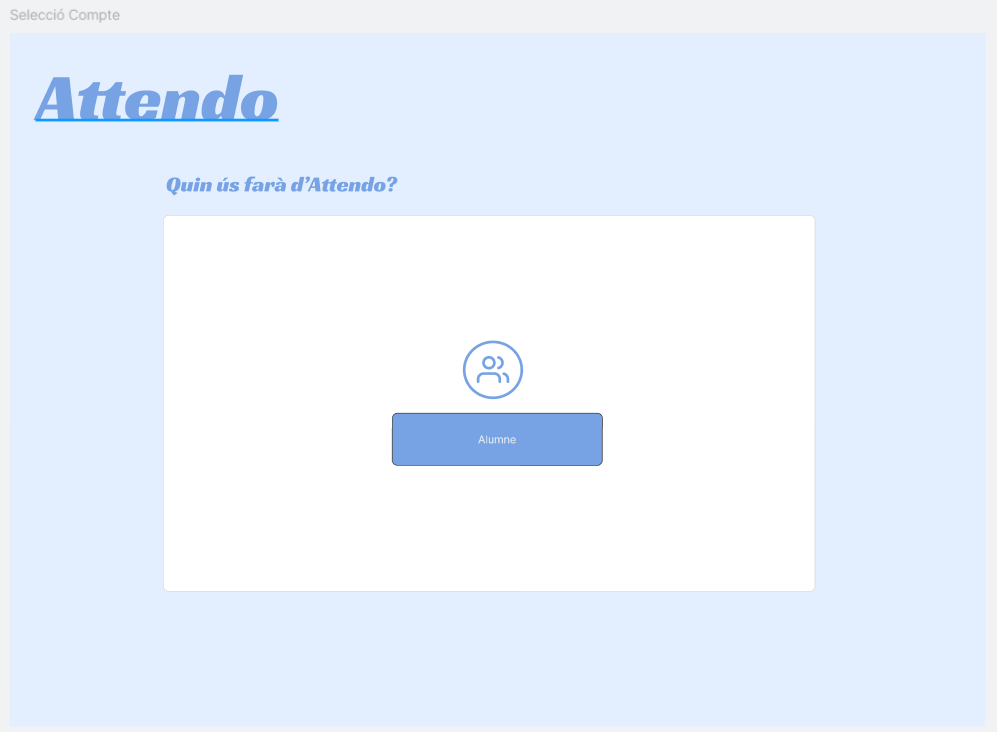

# Projecte-A04-01
### Treball realitzat a les branques "albert" i "karolayn"
## 08/11/24
## Branca DAM - Karolayn Muñoz Ruiz
### Wireframe - DAM "karolayn"

L’aplicació gestiona l'assistència dels estudiants a les classes, llavors la funcionalitat d’aquesta app és saber el seguiment dels usuaris.
Existeixen dos tipus d’usuaris a l’aplicació mòbil: administradors i estudiants.

- L'Alumne/a: haurà de poder accedir a la seva pròpia informació
- Professorat: podran passar llista, veure l’assistència dels seus grups, afegir-se el seu horari, modificar l'assistència, etc.

Per tal de crear el Wireframe d’aquesta aplicació mòbil, s’han de seguir uns passos:

### 1. Definició dels objectius i requeriments
- Inici de sessió i registre per a nous usuaris.
- Página principal: safata d’entrada.
- Principal funció professorat: control d'assistència, modificar horaris, etc.

### 2. Veure exemples ja creats

Es va tenir en compte l’aplicació Dinantia com a exemple per realitzar el disseny d’aquesta aplicació. 
Tot i que no es van afegir totes les funcionalitats que aquesta ofereix.

### 4. Fer com seria l’activitat que els usuaris haurien de fer
Primerament, quan s’obre l’aplicació demana als usuaris iniciar sessió per tal d’accedir a tota la informació, sense tenir en compte si és alumne o professorat. 
Es requereix un nom i una contrasenya per tal d’accedir si ja es té un compte, en el cas contrari només s’ha d’afegir un correu electrònic i confirmar la contrasenya dues vegades.
Una vegada que es troba dins, surt la safata d’entrada, que és una vista general amb últimes notificacions i un menú per tal d’accedir a altres apartats o funcionalitats. 
Aquest menú es caracteritza per tenir opcions com safata d'entrada, assistències, entre altres. Tant l'alumne com el professorat es poden accedir a aquesta vista, enviar missatges i revisar els mòdils que necessiten.
L'alumne pot accedir a la seva pròpia informació, però no pot realitzar cap acció, com modificar les seves assistències. Per el contrari, el professorat pot accedir a les seves dades i modificar les assistències dels seus alumnes.

### 5. Fer wireframe general

# Projecte-A04-01 
## Branca DAW - Albert Penadés Casajús

## Objectius:
#### L’objectiu principal del projecte és la creació d’un sistema de fitxatge per una institució on quedi registrat en quin moment entra i surt una persona en un espai determinat d’un edifici d’una organització (podria ser una empresa, un institut, etc...). 

#### A nivell tècnic caldrà realitzar la creació d'un dispositiu basat en Arduino que permeti la lectura de dades de targetes RFID i l'enviament d'aquestes a una base de dades centralitzada. S'hauran d'integrar diversos components d'infraestructura per a garantir la seguretat, l'escalabilitat i el correcte funcionament d'aquest sistema en un entorn simulat d'empresa.
#### Serà necessari el disseny d’una base de dades que contempli aquests requeriments, així com possibles ampliacions del projecte. Caldrà fer el disseny i planificació de la infraestructura de servidors, així com el seu desplegament en la infraestructura d’Isard. Des del servidor, caldrà recollir les lectures que s’envien des del dispositiu i guardar-les en la base de dades, a més de proporcionar un feedback al dispositiu, per a indicar un possible error.

## Descripció i requeriments tècnics (apartat només de DAW):
### 1. Infraestructura del sistema:
#### El sistema es basarà en una infraestructura composta per diversos servidors:
#### ■ Un servidor web configurat amb un nom de domini
#### ■ Un servidor de base de dades que gestionarà totes les dades generades pel sistema.

### 2. Programació i desplegament:
#### S'haurà de desenvolupar una aplicació web que permeti la gestió ivisualització de les dades de l’alumnat. Tindrem diferents rols:
#### ■ Alumne/a: haurà de poder accedir a la seva pròpia informació
#### ■ Administradors: tindran accés a totes les funcions.
#### ■ Professorat: podran passar llista, veure l’assistència dels seus grups, i afegir-se el seu horari, modificar l'assistència, etc.

## 3. Monitoratge i seguretat:
#### ■ Tots els servidors i dispositius han d'estar monitoritzats constantment, de manera que qualsevol canvi en els arxius o intents de connexió no autoritzada quedin registrats. S’utilitzarà un script amb cron, i avís per correu electrònic.

## Important:
### L' aplicació ha de permetre la gestió de marcatges, horaris i retards, organitzant la informació en funció de la estructura que tingui la organització (departament, pisos, aules, edificis, etc.). 

### El desplegament de l'aplicació web haurà de ser automàtic, connectant-se a un sistema de control de versions (com Git) per actualitzar l’aplicació.

# Documentació Wireframe DAW:
## Iniciar sessió

## Crear compte

### Ens servirà per crear un compte nou

## Selecció d'ús del compte creada

### Depenent de la selecció que hagi triat tindrà opcions diferents

# APARTAT D'ALUMNE

### Podem veure dues imatges, l'única diferència que podem trobar és el menú desplegable, és sol per la visualització. Per cada framework hi ha dues imatges.

### En aquest apartat podem veure que disposa d'un llistat de notificacions al centre, aquest seria les alertes que envia el centre, molt semblant al gmail de google.
### Podem veure a la part superior a la dreta l'imatge del nostre usuari. Si presiona l'icona podem veure que:

## Enviar missatge

### Apartat on l'usuari podrà enviar un correu a qui vulgui. Podrà adjuntar fitxers si ell vol.

## Assistències mòduls

### L'usuari podrà veure les seves assistències. Podem veure que primer estan separades per mòduls. Disposa d'una barra de búsqueda per facilitar l'ús de cerca.

## Assitències separades per RA's

### Podem veure que un cop el nostre alumne hagi entrar al mòdul dessitjat li aparaixen les RA's o resultats d'aprenentatges. Si ens hi fixem podem veure que hi ha una "ruta" just a sobre perquè l'alumne es pugui moure lliurement en aquest apartat.

## Assitències informació de les RA's
### Un cop seleccionada la RA que l'alumne decideix veure, tindrà un llistat de "missatges" conforme ja han passat llista. Aquests tindrà un missatge segons si ha estat present, ha arribat tard o si no ha vingut.

# APARTAT DE PROFESSOR
## Safata d'entrada

### Disposa del mateix format que del alumne,

### Podra enviar correus a altres professors, i als seus alumnes.

## Assitències mòdul

### Disposarà dels mòduls que ell dongui. Si fa clic dins del seu mòdul veurà que:

### Disposarà d'una taula o informació del horari que ell imparteix. També té un botó que servirà per poder editar les hores que ell dóna.

## Taula d'assistència

### Podrà controlar el sistema d'assistència a classe. Podrà posar retards, absències, faltes...

# Apartat d'administrador

### Apartat on podrem veure tot i tenir accès a totes les funcions. Podrem veure els usuaris que s'han creat ja siguit alumnes o professors, podrem veure els horaris, els grups i un apartat de configuració.